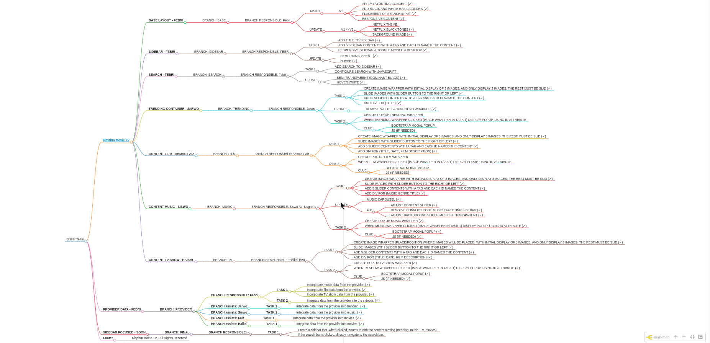

# Stellar Movie TV by Stellar Team

Welcome to the Stellar Movie TV project! This repository hosts the frontend services and API endpoints for accessing film, TV, and music data. Our dataset is powered by applications built with Elixir and Phoenix 1.7.7, utilizing Elixir version 1.16. Below is a detailed overview of the available endpoints and their functionalities. We host a dataset with over 160,000 entries.

To access the backend services and API endpoints, please visit: 
- [Stellar API](https://stellar.febrian.id/) (Stellar)

## Roadmap

To access the roadmap for this project, please visit the following link:

[Roadmap](https://collegeid.github.io/rythym_markmap/)

### Important Note

Please note that only requests from registered CORS URLs are allowed.

## Dataset (Film, TV, Music)
- **Main** : [Preview](https://stellar.febrian.id/) (Stellar)

### General Endpoints

- **GET /:** Displays a Copyright message. [Preview](https://stellar.febrian.id/)
  
### Music Endpoints

- **GET /album/musics:** Displays music albums (Spotify). [Preview](https://stellar.febrian.id/album/musics)
- **GET /check/album/:id:** Displays album details. [Preview](https://stellar.febrian.id/check/album/2lZzryqflrZLO9YDjnlkMz) (Sentimental- Juicy Luicy)
- **GET /tracks/album/:id:** Displays tracks from an album. [Preview](https://stellar.febrian.id/tracks/album/2lZzryqflrZLO9YDjnlkMz) (Sentimental - Juicy Luicy)
- **GET /tracks/find/:query:** Searches for tracks based on a query. [Preview](https://stellar.febrian.id/tracks/find/juicy%20luicy). (Juicy Luicy)

### TV Endpoints

- **GET /tv:** Displays a list of TV shows (filtered for adult content). [Preview](https://stellar.febrian.id/tv)
- **GET /tv/:id:** Displays TV show details. [Preview](https://stellar.febrian.id/tv/1)
- **GET /tv/find/:query:** Searches for TV shows based on a query (TV show title). [Preview](https://stellar.febrian.id/tv/find/breaking)

### Movie Endpoints

- **GET /movies:** Displays a list of movies (filtered for adult content). [Preview](https://stellar.febrian.id/movies)
- **GET /movies/:id:** Displays movie details. [Preview](https://stellar.febrian.id/movies/823464)
- **GET /movies/find/:query:** Searches for movies based on a query (movie title). [Preview](https://stellar.febrian.id/movies/find/inception)

### Combined Search Endpoints

- **GET /cinema/find/:query:** Searches for both movies and TV shows based on a query. [Preview](https://stellar.febrian.id/cinema/find/spiderman%202)
- **GET /trendings/multi:** Displays combined trending albums, movies, and TV shows. [Preview](https://stellar.febrian.id/trendings/multi)

### Multi Trending Endpoints

- **GET /trendings/multi:** Displays combined trending albums, movies, and TV shows. [Preview](https://stellar.febrian.id/trendings/multi)

## Additional Endpoints

### Lite Endpoints

#### Trending and Albums

- **GET /lite/trendings:** Displays minimalized combined trending albums, movies, and TV shows. [Preview](https://stellar.febrian.id/lite/trendings)
- **GET /lite/albums/musics:** Displays minimalized music albums. [Preview](https://stellar.febrian.id/lite/albums/musics)

#### Cinema (TV and Movies)

- **GET /lite/cinema/tv:** Displays minimalized TV shows. [Preview](https://stellar.febrian.id/lite/cinema/tv)
- **GET /lite/cinema/movies:** Displays minimalized movies. [Preview](https://stellar.febrian.id/lite/cinema/movies)

## Contributing

Feel free to open issues or pull requests for any improvements or features you'd like to suggest.

## License

This project is licensed under the MIT License - see the [LICENSE](LICENSE) file for details.
